# Conception & Modélisation 

## Version finale
Pour notre version finale, nous avons amélioré la deuxième version de notre char en ajoutant des renforts imprimés en 3D dans le coffrage et en utilisant des tubes en aluminium pour le rigidifier.

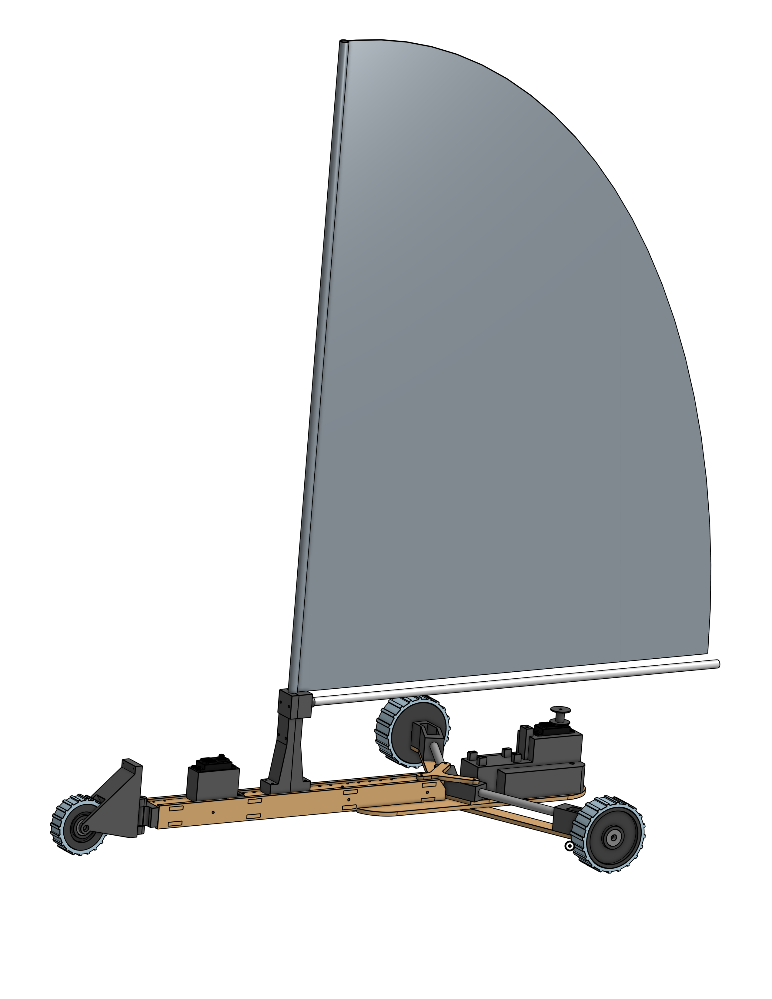

## Coffrage 

Le coffrage est l'élément qui relie la fixation de la roue avant au châssis du char à voile. Il comprend également l'encastrement pour le servomoteur de direction, le support pour le mât et des renforts pour assurer sa rigidité.

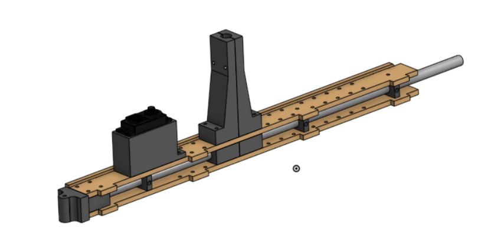

## Longeron horizontal : 
Il s'agit d'une pièce en bois de peuplier découpée à l'aide d'une découpeuse laser. 
Cette pièce est utilisée pour réaliser le coffrage, dont nous avons découpé deux exemplaires : un pour la partie inférieure et un pour la partie supérieure.
La partie supérieure est équipée de plusieurs trous espacés de manière égale, permettant de régler la position du mât le long du longeron.

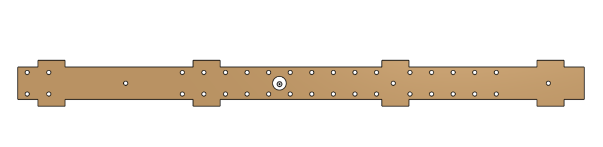

## Longeron vertical : 
Il s'agit d'une pièce en bois de peuplier découpée à l'aide d'une découpeuse laser. 
Cette pièce est également utilisée pour réaliser le coffrage, pour lequel nous avons découpé deux exemplaires : un pour le côté gauche et un pour le côté droit.
Par rapport à la deuxième version, elle comporte trois trous supplémentaires sur le côté pour fixer le longeron au renfort du coffrage.

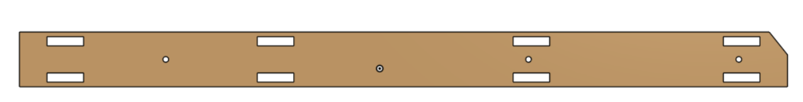

## Renfort des longerons : 
Il s'agit d'une pièce réaliser à l'aide d'une imprimante 3D. 
Cette pièce, située à l'intérieur du coffrage, renforce et rigidifie celui-ci pour éviter que le bois ne se déforme sous le poids du servomoteur et du mât.
Elle comporte quatre petits trous pour visser les quatre parties du coffrage, ainsi qu'un trou plus grand au centre pour laisser passer le tube en aluminium.

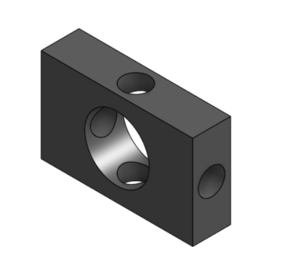

## pièce pour le mât : 
Il s'agit d'une pièce réaliser à l'aide d'une imprimante 3D.
Cette pièce accueille le mât du char et permet à celui-ci de descendre à l'intérieur du coffrage, réduisant ainsi les contraintes sur la pièce.
Comparé à la deuxième version, nous avons décidé de diviser la pièce en deux parties, permettant au mât de glisser à l'intérieur. Ensuite, les deux pièces sont vissées ensemble pour immobiliser le mât.

## Renfort pour le mât : 
Il s'agit d'une pièce réaliser à l'aide d'une imprimante 3D.
Cette pièce, imprimées en deux exemplaires, est située à l'intérieur du coffrage, renforce et rigidifie celui-ci tout en accueillant le mât à l'intérieur.

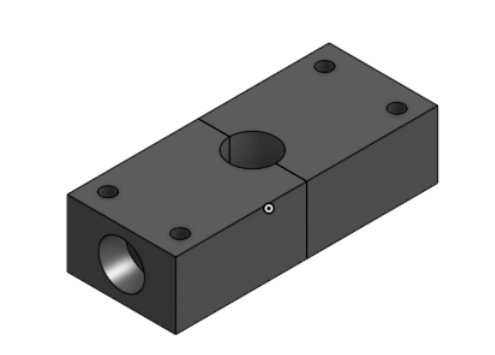

## Tube alu : 
Il s'agit d'un tube en aluminium de 10mm de diamètre.
Nous avons opté pour des tubes en aluminium en raison de leur résistance aux contraintes imposées par le char. 
Ces tubes s'étendent de l'avant du coffrage jusqu'au châssis, du châssis à la fixation des roues principales. Ils servent également de mât et de bôme pour le char.

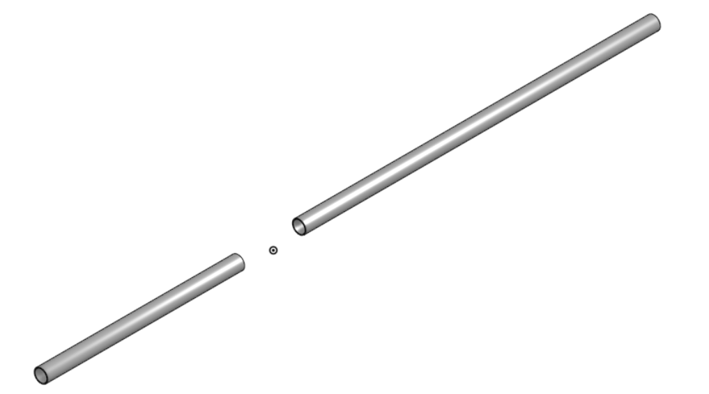

## Pièce roue avant
Il s'agit d'une pièce réaliser à l'aide d'une imprimante 3D.
Cette pièce est fixée au coffrage avec quatre vis et permet d'attacher la roue avant à l'aide d'une vis supplémentaire.

# Le coffrage réaliser
Voici la photo de notre coffrage une fois l'ensemble réaliser et monter :

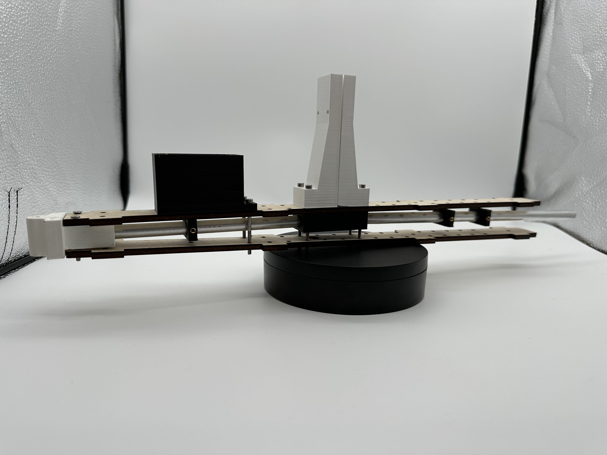

# Châssis 
Le châssis est l'élément central du char, comprenant la base, la pièce tri-branche, le coffrage arrière contenant la batterie, la carte ESP32 et le second servomoteur pour ajuster la voile. Il inclut également les bras pour la fixation des roues principales, les renforts des fixations des bras, et la pièce de renfort entre le coffrage et l'ensemble des composants du châssis.

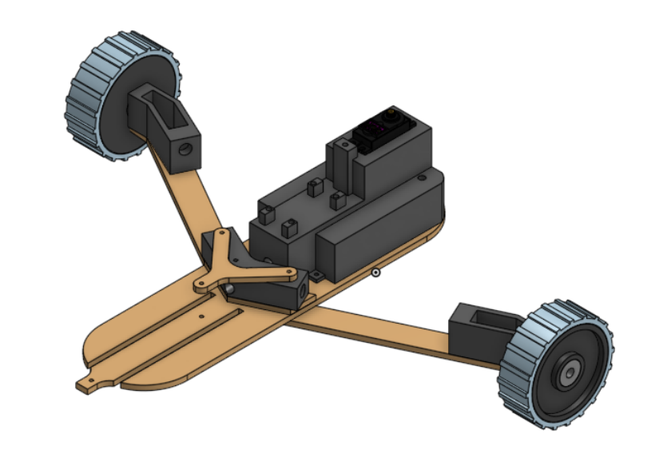

## Base du Châssis
Il s'agit d'une pièce en bois de peuplier découpée à l'aide d'une découpeuse laser. 
Cette pièce constitue la fondation du char à voile. Nous nous sommes inspirés d'un projet existant pour la concevoir. Elle est pourvue de trous permettant de fixer les nombreuses composantes du char et s'emboîte avec le coffrage pour former une seule pièce.

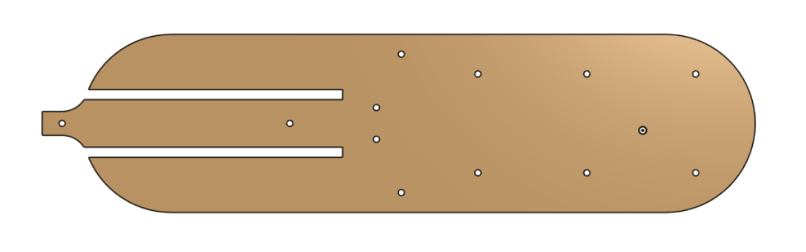

## pièce tri-branche : 
Il s'agit d'une pièce réaliser à l'aide d'une imprimante 3D.
Cette pièce est équipée d'un trou central pour permettre le passage du tube en aluminium reliant le coffrage du mât au coffrage arrière. De plus, elle comporte deux trous orientés à 15 degrés vers l'arrière à ses extrémités, permettant de la relier aux supports des roues principales à l'aide des tubes en aluminium, ce qui renforce l'ensemble de la structure.

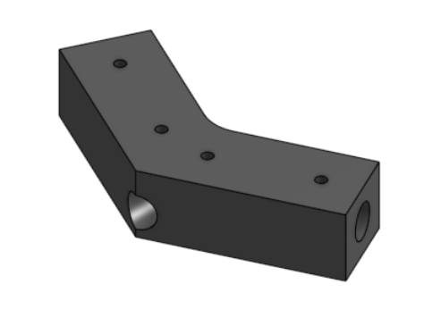

## Renfort longeron : 
Il s'agit d'une pièce en bois de peuplier découpée à l'aide d'une découpeuse laser. 
Cette pièce est positionnée au-dessus de la réhausse et du longeron haut du coffrage. Son rôle est de renforcer et de relier le coffrage avec le châssis.

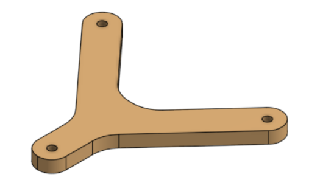

## Coffrage arrière :
Il s'agit d'une pièce réaliser à l'aide d'une imprimante 3D.
Cette pièce est conçue pour loger la Carte ESP32, le servomoteur arrière et la batterie. De plus, elle accueille l'extrémité du tube en aluminium allant du coffrage du mât vers cette pièce, renforçant ainsi la structure du char sur toute sa longueur.
Nous avons opté pour une seule pièce pour loger la carte, le servomoteur et la batterie, afin d'optimiser l'espace sur le châssis qui est déjà assez restreint.

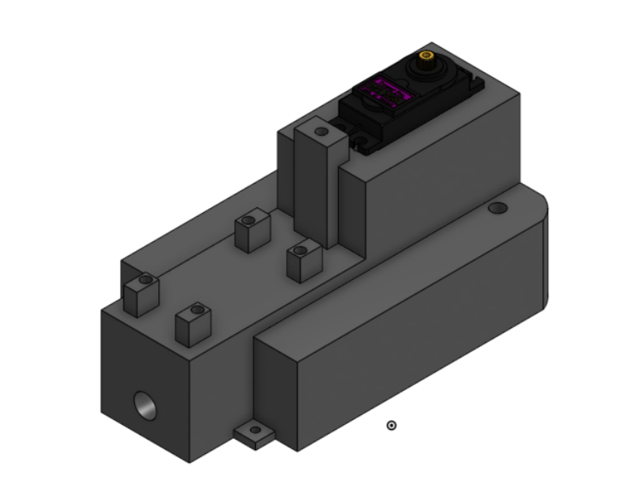

## bras roues principale : 
Il s'agit d'une pièce en bois de peuplier découpée à l'aide d'une découpeuse laser. 
Cette pièce, découpées en deux exemplaires, servent à connecter le châssis aux fixations des roues principales.
Ces pièces ont une longueur de 240 mm, sont montées en dessous et vers le centre du châssis. Nous les avons inclinées de 15 degrés vers l'arrière pour positionner les roues principales vers l'arrière du châssis, ce qui améliore la stabilité et assure une répartition optimale du poids sur les roues.

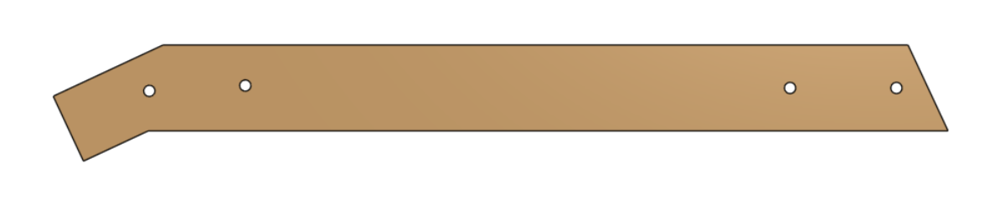

## Renfort fixation bras : 
Il s'agit d'une pièce en bois de peuplier découpée à l'aide d'une découpeuse laser. 
Cette pièce est positionnée au-dessus et vers l'avant du châssis. Son rôle est de renforcer le châssis contre les contraintes du poids susceptible de le plier, ainsi que celles exercées par les bras situés en dessous.

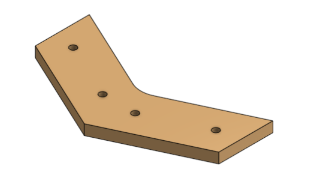

## pièces pour la fixation des roues principales : 
Il s'agit d'une pièce réaliser à l'aide d'une imprimante 3D.
Cette pièce, imprimées en deux exemplaires, se trouvent à l'extrémité des bras et servent à fixer les roues principales au char. Elles sont également reliées à la pièce tri-branche grâce aux tubes en aluminium, ce qui renforce l'ensemble de la structure.

