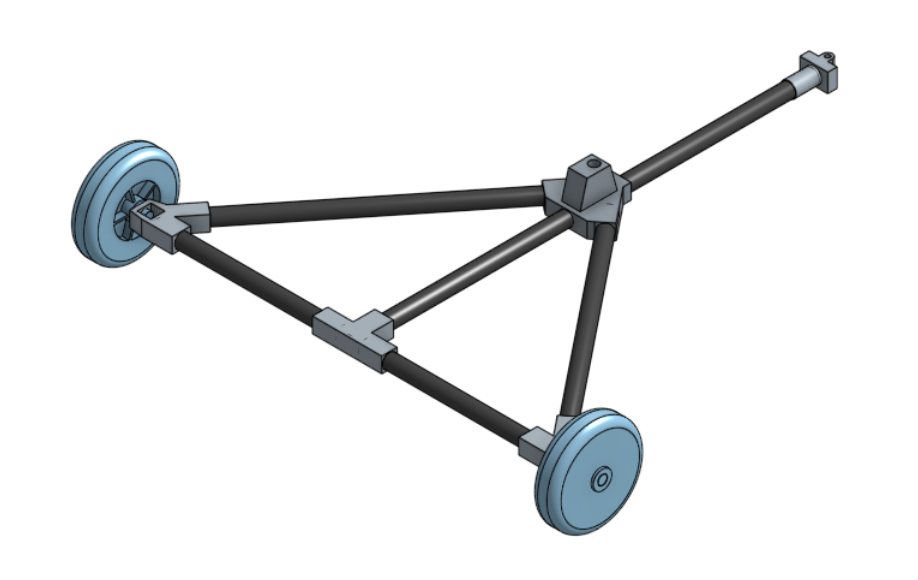

# Conception & Modélisation 

## V1

La première version était uniquement théorique car elle n'a jamais été imprimée. Cette version n'a jamais été concrétisée car mon objectif de faire des PAMI les plus petits possible était compliqué et surtout mal abordé. Cependant, elle m'a permis de mettre sur table tous les éléments nécessaires au PAMI et de mieux visualiser par la suite l'ensemble des éléments à modéliser.