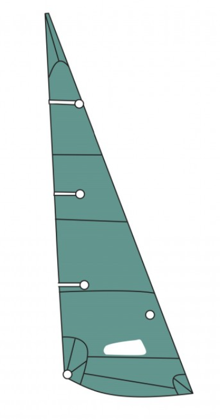

# Conception & Modélisation 

## V1

Pour la première version de notre char à voile, nous avons décidé de le concevoir entièrement de A à Z, en nous basant sur les dimensions des chars à voile déjà existants.

Pour le choix des matériaux, nous avons opté pour un char entièrement fabriqué par impression 3D et renforcé avec des tubes en carbone.

### Pièces en 3D : 
Pièce raccord avant : 

Nous avons imaginé une pièce fabriquée en impression 3D, qui permettrait à la fois de relier les deux tubes en carbone aux raccords des roues principales et de faire passer le tube en carbone de l'arrière vers l'avant du char, mais aussi d'accueillir le mât.

Pièce raccord arrière : 

Nous avons imaginé une pièce en forme de T, fabriquée en impression 3D, qui accueillerait le tube principal et relierait les deux tubes aux raccords des roues principales.

Pièce raccord roues principales : 

Nous avons imaginé une pièce fabriquée en impression 3D, qui accueillerait les deux tubes du raccord arrière et les deux tubes du raccord avant, tout en permettant de fixer les roues principales au char.

### Tubes carbone : 
Voici les tubes en carbone que nous avons trouvés :

Nous avons choisi ces tubes car ils sont très légers et offrent une grande résistance à la traction. Leur seul inconvénient est leur faible résistance à la compression.

### Roues : 
Voici les roues que nous avons trouvés :

Nous avons choisi ces roues car elles permettent un facile dépassement des obstacles mais est également indiquées pour tous les types de sol en extérieur nottament sur le sable.

### Voile :
Voici la voile que nous avons trouvés : 

Nous avons opté pour cette voile en tissu Dacron car elle offre le meilleur équilibre entre qualité, prix et durabilité pour la réalisation de la voile de notre char.

## Conclusion

La première version était uniquement théorique car elle n'a jamais été imprimée. Cette version n'a jamais été concrétisée car très complexe a réaliser et surtout très ambitieuse pour le temps que nous avions.  Cependant, elle nous as permis de mettre sur table tous les éléments nécessaires au char et de mieux visualiser par la suite l'ensemble des éléments à modéliser et à choisir.