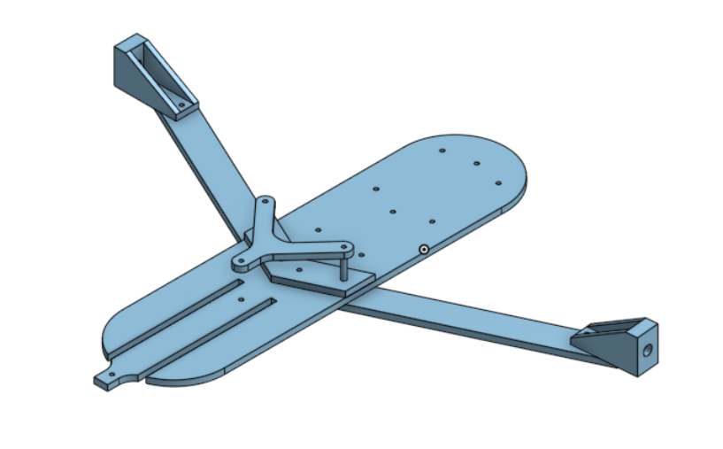
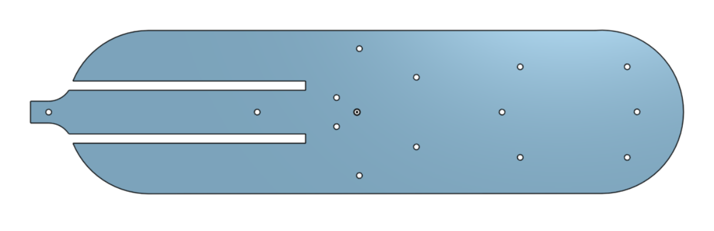
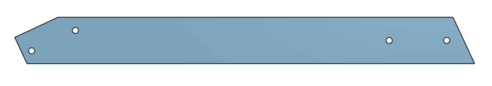
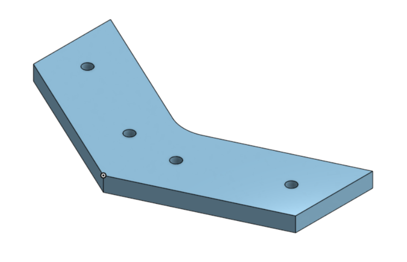
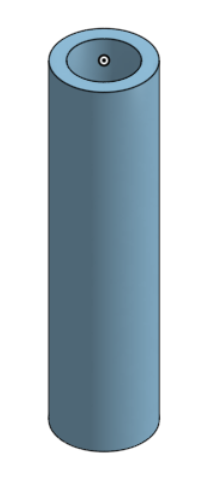
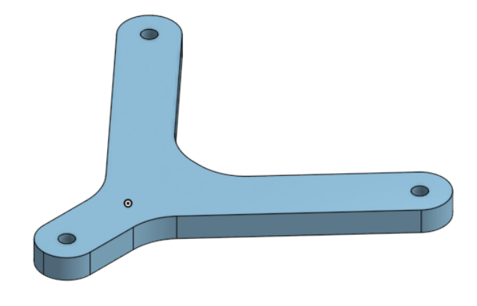
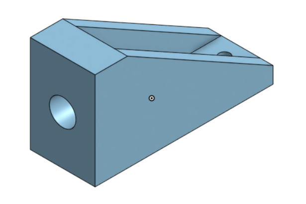
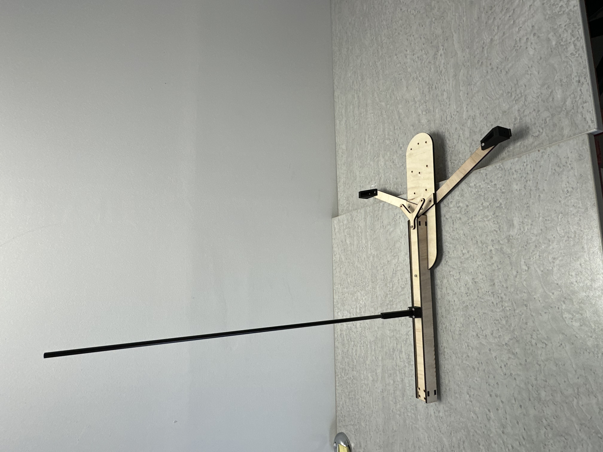

# Conception & Modélisation 

## V2

Pour la deuxième version de notre char, nous nous sommes inspirés d'un projet existant qui nous semblait particulièrement bien réalisé.

Voici le lien du site de notre inspriration : 

[Inspiration du char à voile](https://www.sitakiki.fr/modnaval/char.htm)

### Prototype :
Avant de finaliser la deuxième version complète du char, nous avons décidé de créer un prototype en bois et en impression 3D.

Nous avons récupéré des planches en bois de peuplier de 5 mm d'épaisseur pour fabriquer le coffrage, le châssis et les bras du char. Nous avons également imprimé en 3D la pièce pour fixer la roue avant ainsi que les pièces pour attacher les roues principales.

## Coffrage : 
Le coffrage est l'élément qui relie la fixation de la roue avant au châssis du char à voile. Il comprend également le support pour le mât.

### Longeron horizontal : 
Il s'agit d'une pièce en bois de peuplier découpée à l'aide d'une découpeuse laser. 
Cette pièce est utilisée pour réaliser le coffrage, dont nous avons découpé deux exemplaires : un pour la partie inférieure et un pour la partie supérieure.

### Longeron vertical : 
Il s'agit d'une pièce en bois de peuplier découpée à l'aide d'une découpeuse laser. 
Cette pièce est également utilisée pour réaliser le coffrage, pour lequel nous avons découpé deux exemplaires : un pour le côté gauche et un pour le côté droit.

### pièce pour le mât : 
Il s'agit d'une pièce réaliser à l'aide d'une imprimante 3D.
Cette pièce accueille le mât du char jusqu'à sa base.

### Pièce roue avant :
Il s'agit d'une pièce réaliser à l'aide d'une imprimante 3D.
Cette pièce est fixée au coffrage avec quatre vis et permet d'attacher la roue avant à l'aide d'une vis supplémentaire.

## Châssis : 
Le châssis est l'élément central du char, comprenant la base, le renfort du longeron, les réhausses et les bras + la pièce pour la fixation des roues principales.

### Base du Châssis :
Il s'agit d'une pièce en bois de peuplier découpée à l'aide d'une découpeuse laser. 
Cette pièce constitue la fondation du char à voile. Nous nous sommes inspirés d'un projet existant pour la concevoir. Elle est pourvue de trous permettant de fixer les nombreuses composantes du char et s'emboîte avec le coffrage pour former une seule pièce.

### bras roues principale : 
Il s'agit d'une pièce en bois de peuplier découpée à l'aide d'une découpeuse laser. 
Cette pièce, découpées en deux exemplaires, servent à connecter le châssis aux fixations des roues principales.
Ces pièces ont une longueur de 240 mm, sont montées en dessous et vers le centre du châssis. Nous les avons inclinées de 15 degrés vers l'arrière pour positionner les roues principales vers l'arrière du châssis, ce qui améliore la stabilité et assure une répartition optimale du poids sur les roues.

### Renfort fixation bras : 
Il s'agit d'une pièce en bois de peuplier découpée à l'aide d'une découpeuse laser. 
Cette pièce est positionnée au-dessus et vers l'avant du châssis. Son rôle est de renforcer le châssis contre les contraintes du poids susceptible de le plier, ainsi que celles exercées par les bras situés en dessous.

### Réhausse : 
Il s'agit d'une pièce réaliser à l'aide d'une imprimante 3D.
Cette pièce, imprimées en deux exemplaires, se trouvent entre le renfort de fixation des bras et le renfort du longeron. Elles permettent de renforcé la structure.

### Renfort longeron : 
Il s'agit d'une pièce en bois de peuplier découpée à l'aide d'une découpeuse laser. 
Cette pièce est positionnée au-dessus de la réhausse et du longeron haut du coffrage. Son rôle est de renforcer et de relier le coffrage avec le châssis.

### pièces pour la fixation des roues principales : 
Il s'agit d'une pièce réaliser à l'aide d'une imprimante 3D.
Cette pièce, imprimées en deux exemplaires, se trouvent à l'extrémité des bras et servent à fixer les roues principales au char. Elles sont également reliées à la pièce tri-branche grâce aux tubes en aluminium, ce qui renforce l'ensemble de la structure.

## V2 réalisée :
Voici la photo de notre deuxième version du char : 

## Conclusion :

La deuxième version nous a permis de mieux comprendre les besoins en composants de notre char. Nous avons pu le réaliser et nous avons constaté que le coffrage et le châssis en bois n'étaient pas une mauvaise idée. Nous avons donc décidé de les conserver tout en les améliorant, car nous avons remarqué que le bois avait tendance à se plier sous le poids.