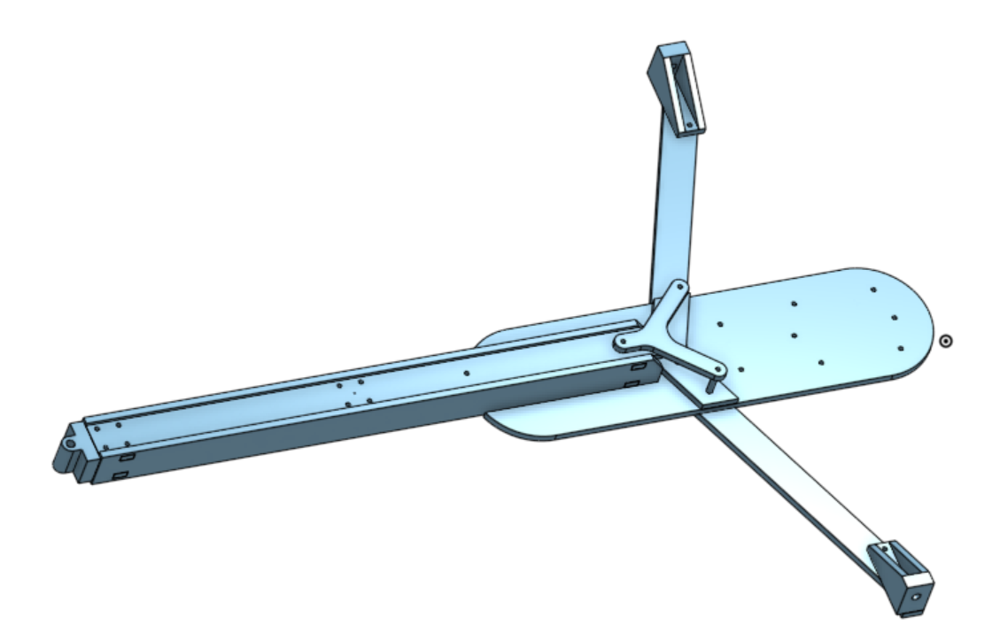
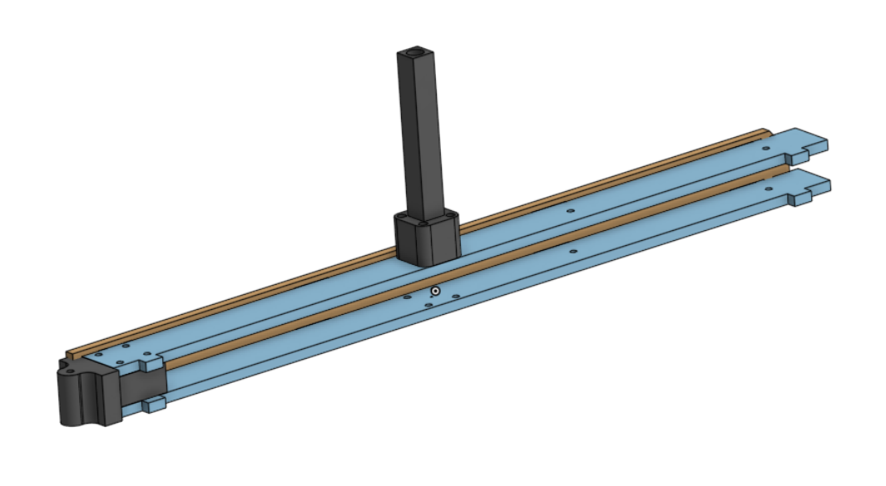
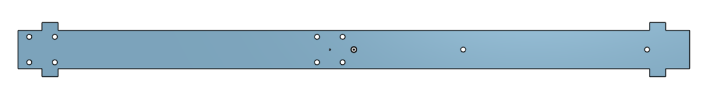
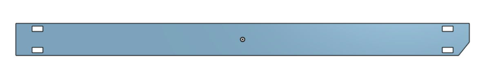
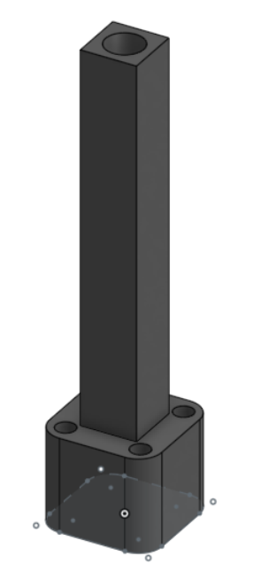

# Conception & Modélisation 

## V2

Pour la deuxième version de notre char, nous nous sommes inspirés d'un projet existant qui nous semblait particulièrement bien réalisé.

Voici le lien du site de notre inspriration : 

[Inspiration du char à voile](https://www.sitakiki.fr/modnaval/char.htm)

### Prototype :
Avant de finaliser la deuxième version complète du char, nous avons décidé de créer un prototype en bois et en impression 3D.

Nous avons récupéré des planches en bois de peuplier de 5 mm d'épaisseur pour fabriquer le coffrage, le châssis et les bras du char. Nous avons également imprimé en 3D la pièce pour fixer la roue avant ainsi que les pièces pour attacher les roues principales.

## Coffrage : 
Le coffrage est l'élément qui relie la fixation de la roue avant au châssis du char à voile. Il comprend également le support pour le mât.

### Longeron horizontal : 
Il s'agit d'une pièce en bois de peuplier découpée à l'aide d'une découpeuse laser. 
Cette pièce est utilisée pour réaliser le coffrage, dont nous avons découpé deux exemplaires : un pour la partie inférieure et un pour la partie supérieure.

### Longeron vertical : 
Il s'agit d'une pièce en bois de peuplier découpée à l'aide d'une découpeuse laser. 
Cette pièce est également utilisée pour réaliser le coffrage, pour lequel nous avons découpé deux exemplaires : un pour le côté gauche et un pour le côté droit.

### pièce pour le mât : 
Il s'agit d'une pièce réaliser à l'aide d'une imprimante 3D.
Cette pièce accueille le mât du char jusqu'à sa base.

### Pièce roue avant
Il s'agit d'une pièce réaliser à l'aide d'une imprimante 3D.
Cette pièce est fixée au coffrage avec quatre vis et permet d'attacher la roue avant à l'aide d'une vis supplémentaire.

