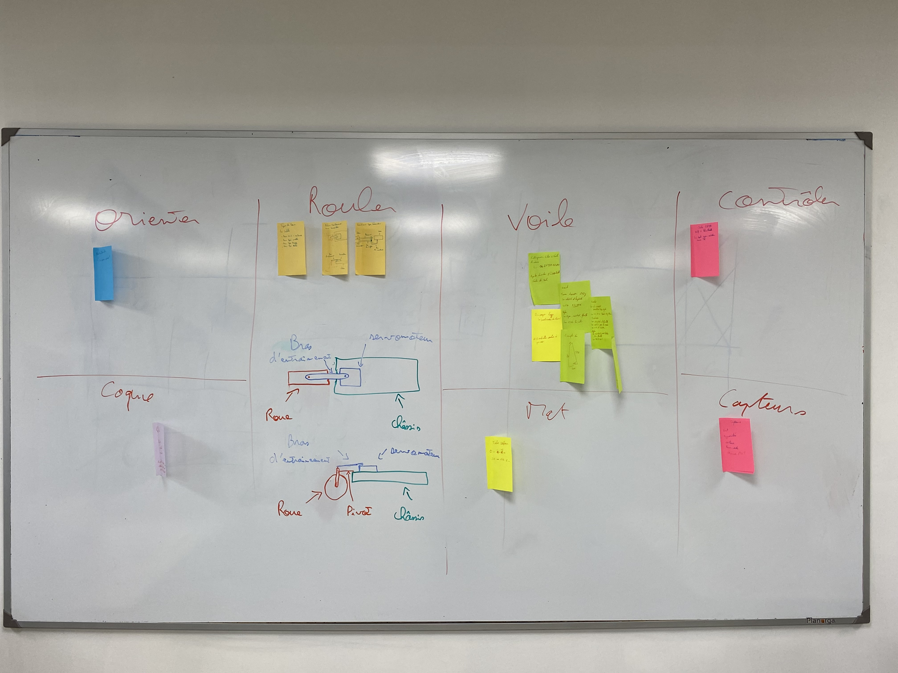

# Conception

## Conception 
Pour débuter, nous avons consacré plusieurs heures à des recherches sur le fonctionnement des chars à voile, en examinant également des projets existants.

Une fois cette étape franchie, nous avons rechercher les meilleurs composants pour notre char, que nous avons répertoriés par catégorie sur des post-it.

Nous avons listé 6 catégories :
1- Orienter
2- Rouler
3- Contrôler
4- Voile 
5- Capteurs
6- Coque

