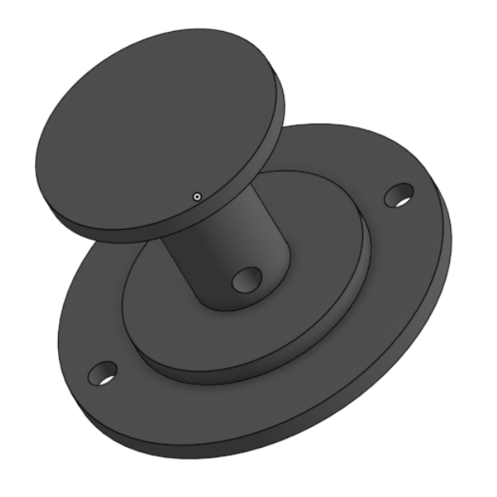

# Servomoteur MG996R

Notre premier servo moteur est une servo standart qui qui à une rotation de 180°. Il est utlisé pour la direction de la roue avant du char à voile et il est commandé par l'ESP32. 

### Caractéristique du servomoteur 

Fabricant : Tower Pro

Type : Servo moteur standard

Modèle : MG996R

Angle de rotation : 180° (±90°)

Vitesse de rotation : 0.17 s/60° à 4.8 V

Couple : 9.4 kg-cm (130.5 oz-in) à 4.8 V

Photo du servo moteur.

## Servomoteur Parallax INC rotation continue HighSpeed

Le second servomoteur est utilisé pour tendre et détendre la voile c'est un servomoteur à rotation continue. 

### Caractéristique du servomoteur.

Fabricant : Parallax Inc.

Type : Servo moteur à rotation continue

Vitesse de rotation : 0.12 s/60° à 6 V 

Couple : 1.6 kg-cm à 6 V

Plage de tension : 4.8 V à 6 V

Courant de fonctionnement : ~140 mA (sans charge), ~900 mA (à couple maximal)

Dimensions : 40.6 x 20.3 x 36.6 mm

Poids : 47 g

Photo du servo moteur.

## Enrouleur : 

La corde viens s'enrouler autour de cette pièce avec un oeillet placé en amont afin de faciliter le bon fonctionnement du système.

## Utilisation des Servomoteurs

Dans un premier temps j'ai utilisé WOKWI pour coder les servos moteurs avec des boutons push-pull ensuite je l'ai retranscrit sur Virtual Code Studio et je l'ai adapté pour qu'il fonctionne avec l'application BLYNK qui fait office de télécommande. 

## Servomoteur MG996R : 

<model-viewer src="../images/MG996RServo.glb" ar ar-modes="webxr scene-viewer quick-look" camera-controls tone-mapping="commerce" shadow-intensity="1">
    

        

    

</model-viewer>