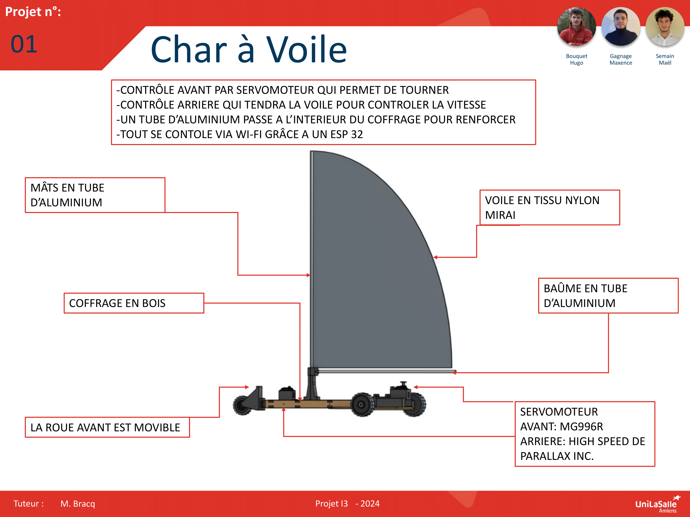

# Bienvenue sur notre documentation

Bienvenue dans la documentation du projet Char à voile télécommandé. Ce site a pour but de fournir toutes les informations nécessaires pour comprendre, utiliser et reproduire efficacement notre projet.

## À propos du Projet

Le projet RC Landyacht consiste a créer un char a voile radiocommandé, le projet tourne donc autour d'un char à voile miniature qui seras controlable avec une application connecté en bluetooth qui permettra de controler la direction ainsi que la voile qui sera plus ou moins tendu pour controler la vitesse du char à voile.

## Poster

Ici vous publierez le poster de votre projet.

<video controls><source src="./images/rc_land_car.webm" type="video/webm" /></video>

---
